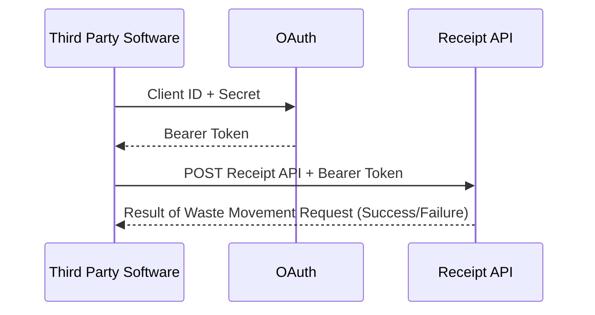

Version 1.0 issued October 2025

# DEFRA Receipt of Waste API Landing Page

## Introduction
This page introduces waste receivers, software developers and third party software users to the DEFRA Waste Tracking Service (DWT) Receipt API. Learn here about the digital processes involved for operators of permitted or licenced waste receiving sites, to report details of each waste movement arriving at their site. This will be mandatory from October 2026.

**Note:** During this document's life-time some of the existing features of the API might be enhanced. You should periodically review the DEFRA Waste Tracking Service (DWT)  Receipt API Landing Page [Changelog](https://github.com/hmrc/ukim-auth-checker-api-service-guide/wiki/UK-Internal-Market-Scheme-(UKIMS)-Authorisation-Checker-API-Landing-page-Changelog).

## Receipt API Overview 

This API is for waste receivers, software developers and third party software users. It enables operators of permitted or licenced waste receiving sites to report details of each waste movement arriving at their site. This will be mandatory from October 2026.


<p>The Receipt API OAS Specification is available [here](https://www.gov.uk/government/publications/digital-waste-tracking-service/digital-waste-tracking-service.)</p>


    
The API is based on REST principles and currently has five endpoints that return data in JSON format and use standard HTTP error response codes, see the table below.

| Endpoint |  Description|
|----------|-------------|
| <font color="green"><b>POST</b></font> | is used to create a record for a waste movement that has arrived at a waste receiving site. It returns a waste tracking ID and a validation result. |
| <font color="orange"><b>PUT</b></font> |is used to update a waste tracking record using a waste tracking ID query parameter to identify the movement. It returns a validation result.|
|<font color="blue"><b>GET</b></font>| is used to retrieve a list of European Waste Codes (EWC).|
|<font color="blue"><b>GET</b></font>|is used to retrieve a list of hazardous waste codes (called Special Waste Codes in Scotland).|
|<font color="blue"><b>GET</b></font>|is used to retrieve a list of Disposal or Recovery codes.|

    
**Note:** At present the API endpoints relate only to Great Britain and Northern Ireland.


## API Status

This version of the Receipt of Waste API:

- supports **only** the API v1.0 Receipt of Waste API for Private Beta customers.
- is currently **not** ready for testing
- will **not** be ready for use in general production until the service goes live


### What makes up a Receive Waste Movement Request?
 The Request Body is the essential part of an API <font color="green"><b>POST</b></font> or <font color="orange"><b>PUT</b></font> request, it containes important data fields that a waste receiver needs to report about a waste movement. 


An example of a complete Receive Waste API Request Body used by the POST and PUT methods is as follows:


```yaml
{
  "organisationApiId": "ba6eb330-4f7f-11eb-a2fb-67c34e9ac07cg",
  "dateTimeReceived": "UTC - 2025-09-15T12:12:28Z, BST - 2025-09-15T13:12:28+01:00",
  "hazardousWasteConsignmentCode": "Company name: CJTILE Ltd → Code prefix: CJTILE/\nUnique ID: A0001\nFull code: CJTILE/A0001\n",
  "reasonForNoConsignmentCode": "Carrier did not provide documentation",
  "yourUniqueReference": "wTBrdgAA020",
  "otherReferencesForMovement": [
    {
      "label": "PO Number",
      "reference": "PO-12345"
    },
    {
      "label": "Waste Ticket",
      "reference": "WT-67890"
    },
    {
      "label": "Haulier Note",
      "reference": "HN-11111"
    }
  ],
  "specialHandlingRequirements": "The waste must be fully inspected by the waste handler according to the Hazardous waste consignment and or EWC codes provided.",
  "wasteItems": [
    {
      "ewcCodes": "200108 biodegradable kitchen and canteen waste, 150109 textile packaging",
      "wasteDescription": "Basic mixed construction and demolition waste, this includes recyclable house bricks, gypsum plaster and slates.",
      "physicalForm": "Sludge",
      "numberOfContainers": 2,
      "typeOfContainers": "rubble bag, refuse sack, pallet",
      "weight": {
        "metric": "Tonnes",
        "amount": 150,
        "isEstimate": true
      },
      "pops": {
        "containsPops": true,
        "components": [
          {
            "name": "Aldrin, Chlordane, Dieldrin.",
            "concentration": 100
          }
        ]
      },
      "hazardous": {
        "containsHazardous": true,
        "hazCodes": "5 - Wastes from petroleum refining, Natural Gas Purification and pyrolitic treatment of coal, 10 - Wastes from Thermal Processes</p>",
        "components": [
          {
            "name": "lead, mercury",
            "concentration": 50
          }
        ]
      },
      "disposalOrRecoveryCodes": [
        {
          "code": "\"code\": \"R1\"\n",
          "weight": {
            "metric": "Tonnes",
            "amount": 150,
            "isEstimate": true
          }
        }
      ]
    }
  ],
  "carrier": {
    "registrationNumber": "England - CBDL123456, CBDU123456, Scotland - WCR/R/522048, Northern Ireland - ROC UT 36, ROC LT 5432",
    "reasonForNoRegistrationNumber": "Waste carrier did not provide a carrier registration number.",
    "organisationName": "Waste Carriers Lite Ltd",
    "address": {
      "fullAddress": "26a Oil Drum Lane, London, UK",
      "postCode": "W12 7ZL"
    },
    "emailAddress": "info@wastecarrierselite.co.uk",
    "phoneNumber": "020 4756 XXXX",
    "vehicleRegistration": "RNT 493",
    "meansOfTransport": "Rail"
  },
  "brokerOrDealer": {
    "organisationName": "Waste Desposal Ltd",
    "address": {
      "fullAddress": "26a Oil Drum Lane, London, UK",
      "postCode": "W12 7ZL"
    },
    "emailAddress": "info@wastecarrierselite.co.uk",
    "phoneNumber": "020 4756 3232",
    "registrationNumber": "England - CBDL123456, CBDU123456, Wales - CBDL124351, CBDU33435, Scotland - WCR/R/522048, Northern Ireland - ROC UT 36, ROC LT 5432"
  },
  "receiver": {
    "organisationName": "string",
    "emailAddress": "info@wastecarrierselite.co.uk",
    "phoneNumber": "020 4756 XXXX",
    "authorisations": [
      {
        "authorisationNumber": "string",
        "regulatoryPositionStatement": 343
      }
    ]
  },
  "receipt": {
    "address": {
      "fullAddress": "26a Oil Drum Lane, London, UK",
      "postCode": "W12 7ZL"
    }
  }
}
```
A description of each of the fields contained in the API Specification [is available here.](https://github.com/DEFRA/waste-tracking-service/blob/main/docs/receipt-data-definitions.md)


## Get Started User Journeys
Use these short guides for practical preparation and use of the API:

- [Developer setup](#developer-setup)
- [Getting started](#getting-started)
- [Making API Requests](#making-api-requests)
- [Validating a Collection of Requests and Responses](#validating-a-collection-of-requests-and-responses)


## Developer Setup

To develop using the Receipt of Waste API, you must:

- be familiar with HTTP, RESTful services and JSON and OAuth
- have received your client id and secret (by email)


## Getting started
To start using the Receipt API, you need first to authenticate your access using your Client ID and Secret which you should have received via email. You will need this to apply to the OAuth service for an access token and make your first receipt of waste movement request. 

The diagram below illustrates the authentication process. For a more detailed description with code snippets you can refer to this [authentication note](https://github.com/DEFRA/waste-tracking-service/blob/main/docs/api-authentication-guide.md).



## Making API requests

Before sending any requests to the Receipt of Waste API, make sure that you are addressing the following points in your software:

- the correct URL for the environment and API version number
- the correct header contents and payload information

For details, see the [Receipt of Waste API v1.0 Reference Guide](https://github.com/DEFRA/waste-tracking-service/blob/main/docs/apiSpecifications/Receipt%20API.yml).

The base URLs of the sandbox and production environments are as follows:

```code 
Sandbox	https://api.server.test/v1/movements/receive/test

Production https://api.server.test/v1/movements/receive
```


### Validating a Collection of Requests and Responses

We have assembled a collection of Bruno test scripts to help you learn about working with the Receipt API. These scripts can [be found here](https://github.com/DEFRA/waste-tracking-service/blob/main/docs/api-testing-and-examples.md).

## Error Responses

A detailed description of the error responses for this API can be found in the [Receipt API v1.0 Reference Guide](https://github.com/DEFRA/waste-tracking-service/blob/main/docs/apiSpecifications/Receipt%20API.yml).
 
## API rate limiting
Each software house should register a single application with HMRC. This application will be used to identify the software house during the OAuth 2.0 grant flow and will also be used in subsequent per user API calls. We limit the number of requests that each application can make. This protects our backend service against excessive load and encourages real-time API calls over batch processing.

We set limits based on anticipated loads and peaks. Our standard limit is 3 requests per second per application. If you believe that your application will sustain traffic load above this value, contact the SDS Team at email [SDSTeam@defra.gov.uk](mailto:SDSTeam@defra.gov.uk XXXX TBD) 

## Changelog

You can find the changelog for this document in the [Receipt API v1.0 Service Guide](https://github.com/DEFRA/waste-tracking-service/wiki/Receipt-API-Service-Guide-Changelog) GitHub wiki.