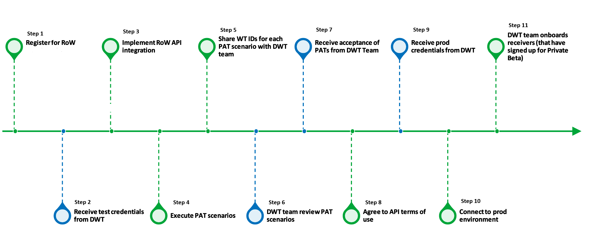

[← Back to Top](README.md){ .md-button }

# Software Developer Onboarding Process

### This document outlines the steps involved in the API software developer onboarding process. 

### Follow the steps in the above diagram with the corresponding steps below:

### 1. Register for the Receipt of Waste (RoW) API  Private Beta
Software providers must first register for the Receipt of Waste (RoW) private beta.

The sign-up link for this registration is available on both the project’s GitHub page available here: [Sign up for our Digital Waste Tracking Private Beta test](private-beta-comms-sign-up.md) and the  [government guidance page](https://www.gov.uk/government/publications/digital-waste-tracking-service/mandatory-digital-waste-tracking).

### 2. Receive Test Credentials from the Digital Waste Tracking (DWT) Team
Following registration, software developers receive test credentials from the DWT team.

These credentials consist of a client ID and a client secret, sent via an encrypted email.

### 3. Implement Receipt of Waste (RoW) API Integration
Using the provided test credentials, software developers begin building the integration between their software and the Receipt of Waste API.

Developers can use the available GET reference data endpoints to retrieve necessary codes for container types, hazardous properties, and other required data.

### 4. Execute the Production Approval Test (PAT) Scenarios
Once the integration is built, developers must execute Production Approval Test (PAT) scenarios. See [Production Approval Tests](production-approval-tests.md). 

These scenarios are written in a Gherkin/BDD acceptance criteria format to ensure the software caters to all required API functionality.

Scenarios range from basic waste receipts with a single item to complex mixtures of hazardous and persistent organic pollutants (POPs) components.

### 5. Share WT IDs for Each PAT Scenario with the DWT Team
Upon successful completion of the tests, the developer must provide the Waste Tracking (WT) ID for each executed PAT scenario to the DWT team.

### 6. The DWT Team Review PAT Scenarios
The DWT team reviews the submitted IDs for the production approval test scenarios to ensure they satisfy the teams expectations.

### 7. Receive Acceptance of PATs from the DWT Team
The software developer receives a formal acceptance from the DWT team once their PAT scenarios have been successfully reviewed.

### 8. Agree to the API Terms of Use
Following acceptance, developers must read and agree to the API terms of service.

The full terms are available on GitHub for review in advance. See [Terms of Service](api-terms-of-service.md).

### 9. Receive Production Credentials from the DWT Team
Once the terms of service are agreed to, the DWT team issues the production credentials to the software developer.

### 10. Connect to the Production Environment
The software developer uses the production credentials to establish a connection to the live production environment.

### 11. The DWT Team Onboards Receivers (that have signed up for Private Beta)
The DWT team then onboards waste receivers of the software developer who have already registered their interest in the private beta.

Receivers accept terms and conditions manually via email, after which they receive their own API codes to share with their software teams to begin submitting real waste movement data.

## Changelog

You can find the changelog for this document in the [Onboarding Software Developers](https://github.com/DEFRA/waste-tracking-service/wiki/Software-Developer-Onboarding-Process) GitHub wiki page

 Page last updated on January 19th 2026.