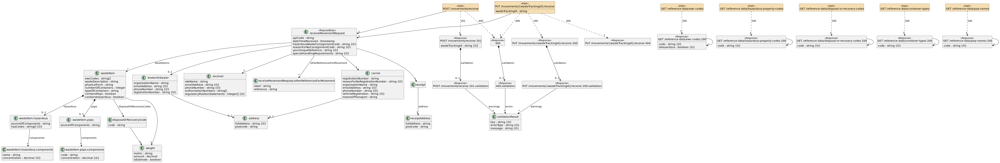

!!! info
    **`From 1 October 2026, permitted or licenced sites in England and Wales will need to report their waste digitally, using the report receipt of waste service. In Northern Ireland and Scotland this comes into effect on 1 January 2027.`**
    
# Receipt of Waste - API Specification

Are you a waste receiver or software provider and want to get involved? [Sign up for our Digital Waste Tracking Service](api-register-as-a-software-provider.md). 

These APIs are currently in Public Beta stage. They may be updated to reflect changes to policy, legislation and user feedback.

We are designing waste tracking APIs to be flexible and accommodate differences in business processes, allowing for:

- separate submission of waste collection and receipt data, whilst maintaining a connection between the two
- differences in data requirements
- data to be submitted in any order (e.g. receipt before collection)

## Open API specification
The swagger specification is published on the Swagger API hub:

- [receipt of waste API specification](../apiSpecifications/)

## API Change Log
The following page lists all of the changes to the API specification since it was first published:

- [receipt of waste API change log](https://github.com/DEFRA/waste-tracking-service/wiki/Receipt-of-Waste-API-Changelog)

 Page last updated on April 10th 2026.

