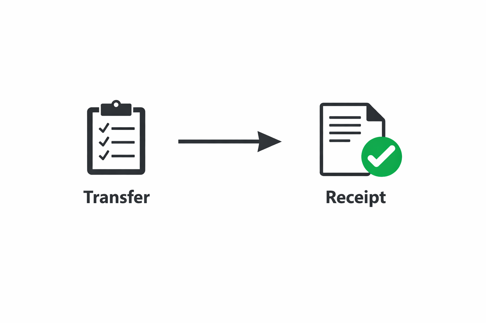
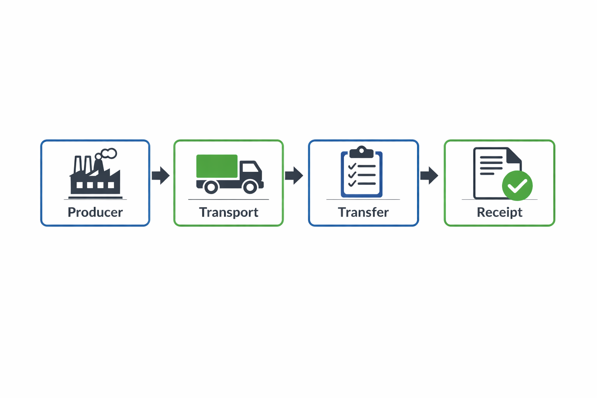

# Endpoint Comparison: Receipt API vs Collections API

!!! info
    This page provides a clear, side‑by‑side comparison of the **Phase 1 Receipt of Waste API** and the **Phase 2 Collections API**, highlighting what is new, what has changed and what remains the same.

---

## 1. Overview

Phase 1 and Phase 2 serve different stages of the waste Collection:

- **Receipt API (Phase 1)** — Used by receivers to record the final receipt of waste.
- **Collections API (Phase 2)** — Used by carriers/brokers to create Movements and record Collections before drop‑off.

The Collections API complements the Phase 1 Receipt of Waste API by enabling end‑to‑end tracking from creation through to collection, drop‑off (transfer) and receipt.

---

## 2. Endpoint Summary Table

| API              | Endpoint                                      | Purpose                     | Notes                               |
|------------------|-----------------------------------------------|-----------------------------|--------------------------------------|
| **Receipt API**  | POST /receipts                                | Create a receipt            | Final stage only                     |
| **Receipt API**  | PUT /receipts                                 | Update a receipt            | Final stage only                     |             
| **Receipt API**  | GET /receipts/{id}                            | Retrieve receipt            | No Movement context                  |
| **Receipt API**  | GET /transfers/{id}                           | Retrieve transfer           | Transfer must already exist          |
| **Collections API** | POST /movements                            | Create a Movement           | New in Phase 2                       |
| **Collections API** | GET /movements/{movementId}                | Retrieve Movement           | Includes create‑time payload         |
| **Collections API** | PUT /movements/{movementId}                | Update Movement             | Optional but recommended             |
| **Collections API** | POST /movements/{movementId}/collection    | Record collection           | One per Movement                     |
| **Collections API** | PUT /movements/{movementId}/collection     | Update collection           | Update pickup details                |
| **Collections API** | GET /movements/{movementId}/collection     | Retrieve collection         | Returns collection resource          |

## 3. Purpose Comparison

### Receipt API (Phase 1)

- Records **receipt** of waste at the receiving site
- Assumes a Transfer already exists
- No concept of Movement or Collection.

### Collections API (Phase 2)

- Creates **Movements**
- Records **Collections**
- Enables full Collection tracking.

A Movement has exactly one collection event… Multi‑collection journeys are represented by multiple Movements.

## 4. Workflow Differences

### Phase 1 Workflow
[](api-phase1-workflow-1.png)
### Phase 2 Workflow
Movement → Collection → Transfer → Receipt
[](api-phase2-workflow.png)
### Migration Impact

- Carriers must now create Movements and record Collections
- Receivers continue using the Receipt API unchanged.

## 5. Request/Response Differences

### Movement Creation (Phase 2)

```json
{
  "producerDetails": { "organisationName": "Producer Org" },
  "carrierDetails": { "organisationName": "Carrier Ltd" }
}
```

Response includes:

```json
{
  "movementId": "WM-2026-000001234",
  "validation": { "warnings": [] }
}
```
Collection Recording (Phase 2)

```json
{
  "collectionDateTime": "2026-07-01T09:15:00Z",
  "carrierDetails": { "organisationName": "Carrier Ltd" }
}
```

### Receipt Creation (Phase 1)

- TransferId
- Waste quantities
- Container types
- Hazardous properties

## 6. Identifier Differences

| Identifier | Phase 1 | Phase 2 |
| --- | --- | --- |
| MovementId | ❌ Not used | ✔️ Introduced |
| TransferId | ✔️ Used | ✔️ Used |
| ReceiptId | ✔️ Used | ✔️ Used |

**Note:** MovementId is new and must be stored for linking to Collections and Transfers.

**Note:** MovementId is minted on POST /movements and used for collection and later queries.

## 7. Validation Differences

**Shared**

Both APIs use the same validation envelope:

- warnings
- errors
- errorType values such as InvalidFormat, NotProvided, BusinessRuleViolation

**Example (Phase 2)**

```json

{
  "validation": {
    "errors": [
      {
        "key": "collectionDateTime",
        "errorType": "InvalidFormat",
        "message": "\"collectionDateTime\" must be an ISO 8601 date-time"
      }
    ]
  }
}
```

## 8. Business Rule Differences

**Phase 1**

- Transfer must exist before Receipt
- Hazardous rules apply at receipt stage.

**Phase 2**

- Exactly one collection per Movement
- Multi‑pickup routes require multiple Movements
- Hazardous Movements cannot be aggregated.

If any linked Movement is hazardous, a Transfer must cover exactly one Movement.

## 9. Developer Impact Summary

**New responsibilities (Phase 2)**

- Create Movements
- Record Collections
- Store MovementIds
- Update Transfer logic.

**Unchanged responsibilities (Phase 1)**

- Record Receipts
- Handle TransferId and ReceiptId
- Use existing validation envelope.

10. Summary Table

| Area | Receipt API (Phase 1) | Collections API (Phase 2) |
| --- | --- | --- |
| Collection stage | Receipt only | Movement + Collection |
| Identifiers | TransferId, ReceiptId | MovementId, TransferId |
| Required data | Receipt details | Collection timestamp + carrier |
| Hazardous rules | At receipt | At transfer |
| Validation | Phase 1 envelope | Same envelope |
| Authentication | OAuth2 | OAuth2 |
| Client changes | Minimal | Significant |

Page last updated: June 2026.