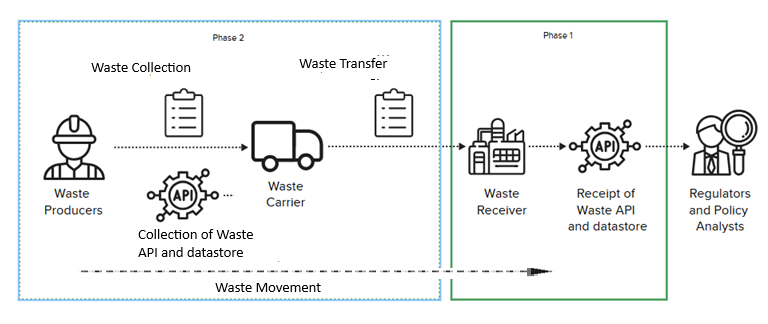

!!! Info
    Currently in development

Version 1.0 issued June 23rd 2026

# Welcome to the Phase 1 to Phase 2 Migration Guide
Phase 2 introduces an expanded role to the management of Digital Waste Tracking in the United Kingdom. It's designed for teams migrating from Phase 1 (Receipt API) to Phase 2 (Collections API). If you already use the Phase 1 Receipt of Waste API, this guide explains what has changed, what has stayed the same, and how to think about the new workflow from a developer’s perspective.This guide explains how developers interact with both APIs, showing the differences in endpoints, payloads, validation, and workflow logic.

## What Phase 2 Actually Adds

Phase 1 covers only the final step of the waste journey. Phase 2 expands this into a full end‑to‑end Collection.

### Phase 1 Workflow
[](initial-scope-receivers-only.png)<br>
### Phase 2 Workflow
[](api-phase2-workflow2.png)
<br>
This means:

- Carriers and brokers now create Movements.

- Each Movement has exactly one Collection.

- Transfers can reference one or more Movements (except hazardous).

- Receivers continue to record Receipts exactly as before.

!!! Important
    **Phase 2 does not replace Phase 1 — it extends it.**

## 1. Conceptual Overview

### Phase 1 — Receipt API

Receivers only interact with waste after it arrives.
You receive a transferId, and you create a receipt. Used by receivers to record the final acceptance of waste.

- No concept of Movement or Collection

- Assumes a Transfer already exists

- Simple, single‑stage workflow

### Phase 2 — Collections API

- Waste Operators now track the full waste Collection from the moment it is created.

- The API is used by carriers/brokers to track the full Collection of the Waste.

#### What do Waste Operators do in Phase 2?

- Create a Movement

- Record a Collection

- Link one or more Movements to a Transfer

- The receiver still records the Receipt (Phase 1)

This introduces a new identifier:

**MovementId**  — created by the server, opaque, must be stored

The most important thing to realise about Phase 2, is this:

!!! Important
    **The MovementId is the backbone of the new Waste Collection API.**

## 2. Workflow Comparison

**Phase 1 Workflow**

Transfer → Receipt

**Phase 2 Workflow**

Movement → Collection → Transfer → Receipt

**Key change:**

Developers must now create and store **MovementId**, and record the Collection before Transfer.

## 3. Endpoint Usage Comparison
<BR>

**Phase 1: Receipt API Endpoints**

| Action | Endpoint | Notes |
| --- | --- | --- |
| Create Receipt | ``POST ``/receipts | Final stage only |
| Update Receipt | ``PUT ``/receipts | Final stage only |
| Get Receipt | ``GET ``/receipts/{id} | No Movement context |
| Get Transfer | ``GET ``/transfers/{id} | Transfer must already exist |

**Phase 2: Collections API Endpoints**

| Action | Endpoint | Notes |
| --- | --- | --- |
| Create Movement | ``POST ``/movements | Generates MovementId |
| Get Movement | ``GET ``/movements/{movementId} | Includes creation payload |
| Update Movement | ``PUT ``/movements/{movementId} | Optional |
| Record Collection | ``POST ``/movements/{movementId}/collection | One per Movement |
| Update Collection | ``PUT ``/movements/{movementId}/collection | Update pickup details |
| Get Collection | ``GET ``/movements/{movementId}/collection | Retrieve collection |

## 4. Payload Comparison

### 4.1 Creating a Movement (Phase 2)

**Request**

```json
{
  "producerDetails": 
    { 
    "organisationName": "Producer Org" 
    },
  "carrierDetails": 
    { 
    "organisationName": "Carrier Ltd" 
    }
}
```
**Successful Response**

```json
{
  "movementId": "WM-2026-000001234",
  "validation": 
    {
    "warnings": [] 
    }
}
```

### Developer notes

- The movementId is server‑minted and opaque. Store it, do not parse it.

- Keep this ID for all later operations.

### 4.2 Recording a Collection (Phase 2)

**Request**

```json
{
  "collectionDateTime": "2026-07-01T09:15:00Z",

  "carrierDetails": 
    { "
    organisationName": "Carrier Ltd" 
    }
}
```

**Response**

```json
{
  "collectionDateTime": "2026-07-01T09:15:00Z",

  "validation": 
  { 
    "warnings": [] 
  }
}
```

### Developer notes

- Exactly one collection per Movement.

- Multi‑pickup routes require multiple Movements.

### 4.3 Creating a Receipt (Phase 1)

**Request**

```json
{
  "transferId": "T-123",
  "wasteDetails": 
  {
    "quantity": 1200,
    "unit": "kg"
  }
}
```

### Developer notes

- Receipt API does not use movementId, it uses the transferId.

- Transfer must already exist.

## 5. New Identifier Behaviour

| Identifier | Phase 1 | Phase 2 | Notes |
| --- | --- | --- | --- |
| ``movementId`` | ❌ Not used | ✔️ Required | Server‑generated, opaque |
| ``transferId`` | ✔️ Required | ✔️ Required | May reference multiple Movements (non‑hazardous) |
| ``receiptId`` | ✔️ Returned | ✔️ Returned | Unchanged |

**Important**

The **movementId** is created in Phase 2 and must be stored for:

- Collection

- Transfer

The **transferId** is also created in Phase 2 and must be stored for:

- Receipt

## 6. Validation Object Return (Shared Across Both Phases and APIs)

Both APIs return the same structure:
```json
{
  "validation": {
    "warnings": [],
    "errors": [
      {
        "key": "collectionDateTime",
        "errorType": "InvalidFormat",
        "message": "\"collectionDateTime\" must be an ISO 8601 date-time"
      }
    ]
  }
}
```
### Developer Notes

- Validation is consistent across both APIs.

- errorType values include:

    InvalidFormat

    NotProvided

    BusinessRuleViolation

## 7. Business Rule Differences

### Phase 1

- Transfer must exist before Receipt.

- Hazardous rules apply at receipt stage.

### Phase 2

- Exactly one collection per Movement.

- Multi‑pickup routes require multiple Movements.

- Hazardous Movements cannot be aggregated into a single Transfer.

If any linked Movement is hazardous, a Transfer must cover exactly one Movement.

## 8. Developer Responsibilities

### Phase 1 (Receivers)

- Record Receipts.

- Store transferId and receiptId.

- Handle validation envelope.

### Phase 2 (Carriers/Brokers)

- Create Movements.

- Record Collections.

- Store MovementIds.

- Update Transfer logic to support multiple Movements.

- Handle validation envelope.

## 9. Summary Table

| Area | Phase 1 Receipt API | Phase 2 Collections API |
| --- | --- | --- |
| Collection stage | Receipt only | Movement + Collection |
| Identifiers | TransferId, ReceiptId | MovementId, TransferId |
| Required data | Receipt details | Collection timestamp + carrier |
| Hazardous rules | At receipt | At transfer |
| Validation | Same envelope | Same envelope |
| Authentication | OAuth2 | OAuth2 |
| Client changes | Minimal | Significant |

## 10. Migration Guidance 
### To migrate from Phase 1 to Phase 2:

1. Add support for creating Movements.

2. Store MovementId in your system.

3. Add support for recording Collections.

4. Update Transfer logic to reference one or more Movements.

5. Keep Receipt API integration unchanged.

6. Reuse your existing validation‑handling code.
